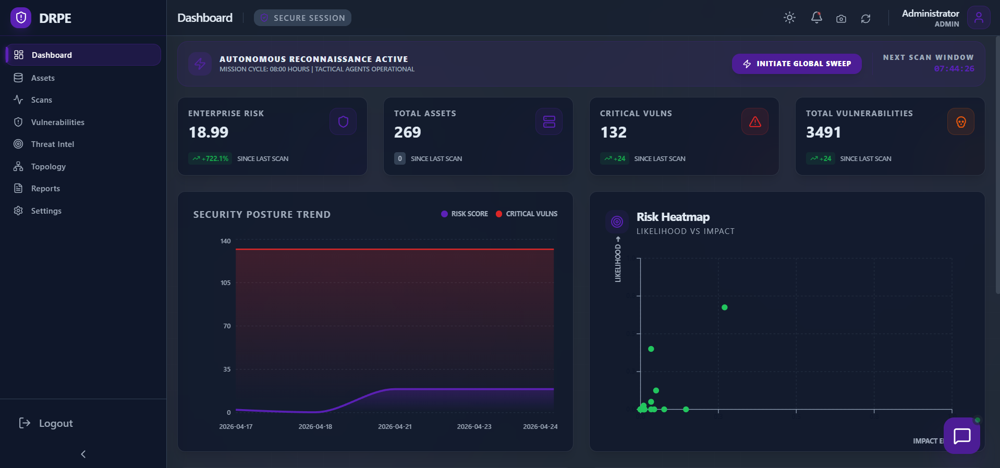
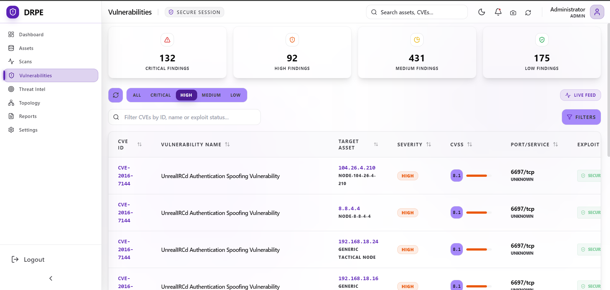
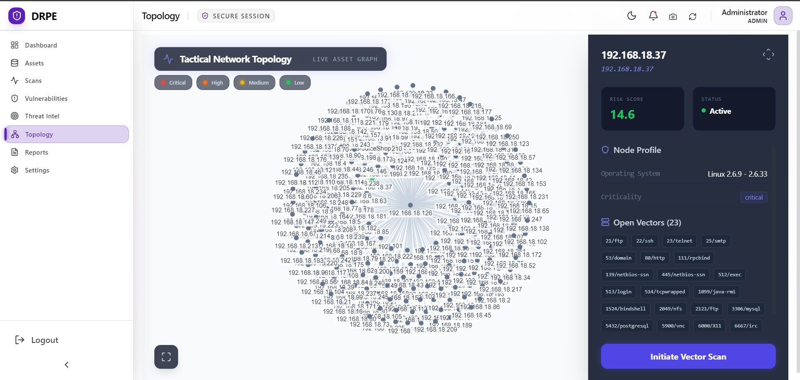
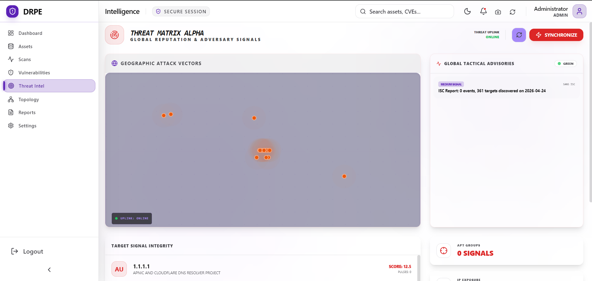

<div align="center">
  <h1>🛡️ DRPE - Dynamic Risk Posture Evaluation</h1>
  <p><strong>A Next-Generation Security Intelligence & Autonomous Reconnaissance Platform</strong></p>
</div>

<br />

DRPE (Dynamic Risk Posture Evaluation) is an advanced security intelligence platform designed for autonomous network reconnaissance, vulnerability management, and real-time risk assessment. It integrates seamlessly with industry-standard scanners and threat intelligence feeds to provide a comprehensive, unified view of your organization's security posture.

---

## ✨ Key Features

- **Autonomous Reconnaissance:** Integrated with Nmap and OpenVAS (GVM) for deep, automated network discovery and scanning.
- **Neural Risk Engine:** Employs a composite risk scoring algorithm based on CVE severity, exploit availability, and real-world threat intelligence.
- **Mission Control Dashboard:** A live tactical feed presenting security events, system health, and enterprise-wide risk heatmaps.
- **Threat Intelligence Integration:** Real-time correlation with OTX, AbuseIPDB, and MISP feeds to contextualize vulnerabilities.
- **Operative Identity & Access:** Secure user management featuring persistent tactical profiles and secure key rotation.
- **Modern User Interface:** A sleek, responsive dashboard built with a "Mission Control" aesthetic, optimized for security analysts.

---

## 📸 Interface Preview

### Mission Control Dashboard


### Vulnerability Management


### Network Topology & Assets


### Threat Intelligence & Reporting


---

## 🛠️ Technology Stack

**Frontend:**
- React.js
- Vite
- TailwindCSS (Modern "Mission Control" Aesthetic)

**Backend:**
- FastAPI (Python 3.10+)
- SQLAlchemy (Async)
- PostgreSQL

**Orchestration & Infrastructure:**
- Docker & Docker Compose
- Integration with OpenVAS / GVM & Nmap

---

## 🚦 Quick Start

### Prerequisites
- Docker and Docker Compose installed on your system.

### Installation

1. **Clone the repository:**
   ```bash
   git clone https://github.com/yourusername/drpe.git
   cd drpe
   ```

2. **Configuration:**
   Update the environment variables in `backend/.env` with your tactical credentials (database URI, API keys for OTX/AbuseIPDB, etc.).

3. **Launch the platform:**
   Bring up the entire stack using Docker Compose:
   ```bash
   docker-compose up -d --build
   ```

4. **Access the Interface:**
   Navigate to `http://localhost:81` in your web browser to access the Command Interface.

---

## 📖 Documentation

Detailed architectural and integration guides can be found in the `docs/` directory:
1. [Architectural Data Flow](./docs/ARCHITECTURE_FLOW.md)
2. [Scanner Setup & Integration](./docs/SCANNER_SETUP.md)
3. [User Manual](./User_Manual.md)

---

## 🎥 Demo Video

*(Link your Demo Video here. You can upload the video to YouTube/Vimeo and link it, or upload the MP4 file to a `media/` folder in this repository and link directly to it.)*


https://github.com/user-attachments/assets/1fd40c9e-58ab-4d45-b050-d0345d75d461


---

## 📄 License

This project is licensed under the MIT License.
